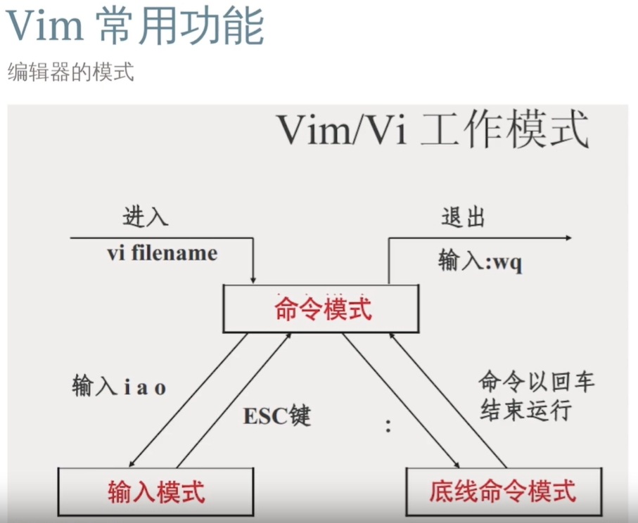
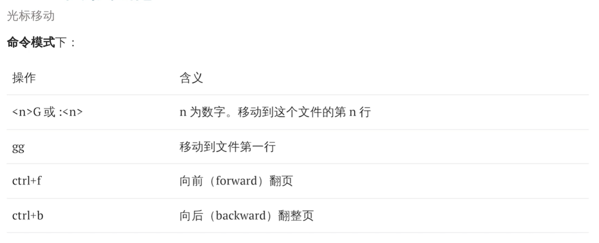
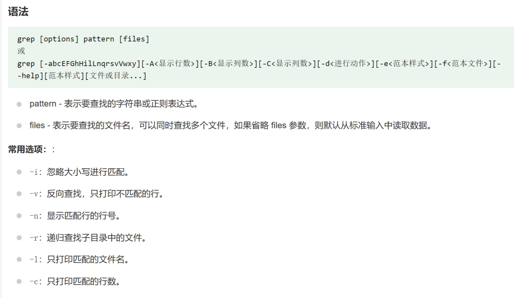

# Note lab0

## vim




### 命令模式：

H J K L--左下上右  W E B--以单词为单位进行移动




/<word> ：搜索 N键向下翻滚；shift + N向上翻滚

:noh ：取消高亮

p粘贴到所在行的下一行 P粘贴到所在行的上一行


### 可视模式

此外，还有可视模式让我们可以选择文本块进行操作

1. 用v命令进入的字符可视化模式（Characterwise visual mode)。文本选择是以字符为单位的。
2. 用V (shift+v) 命令进入的行可视化模式（Linewise visual mode)。文本选择是以行为单位的。大写I进入插入模式。
3. 用ctrl+v进入的块可视化模式（Blockwise visual mode）。使用按键j/k/h/l进行选中多行多列,一个矩形内的文本。

## Makefile

$<:dependency内容

$@:target内容

*.o:所有的.o文件

*.c:所有的.c文件

外层Makefile调用内层Makefile

```shell
all: test.o funcdir
	$(MAKE) -C funcdir	//进入内层文件夹
	gcc funcdir/function.o test.o -o test
.PHONY: clean
clean:
	rm -f *.o test
	$(MAKE) clean -C funcdir
```

## shell

“ ”中的$1被会解释

而’ ‘中的$1不会被解释

## 进阶

**find**

**grep**



**sed**

**awk**

