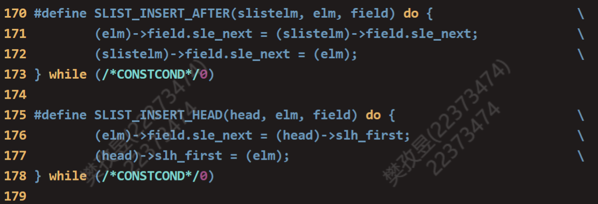
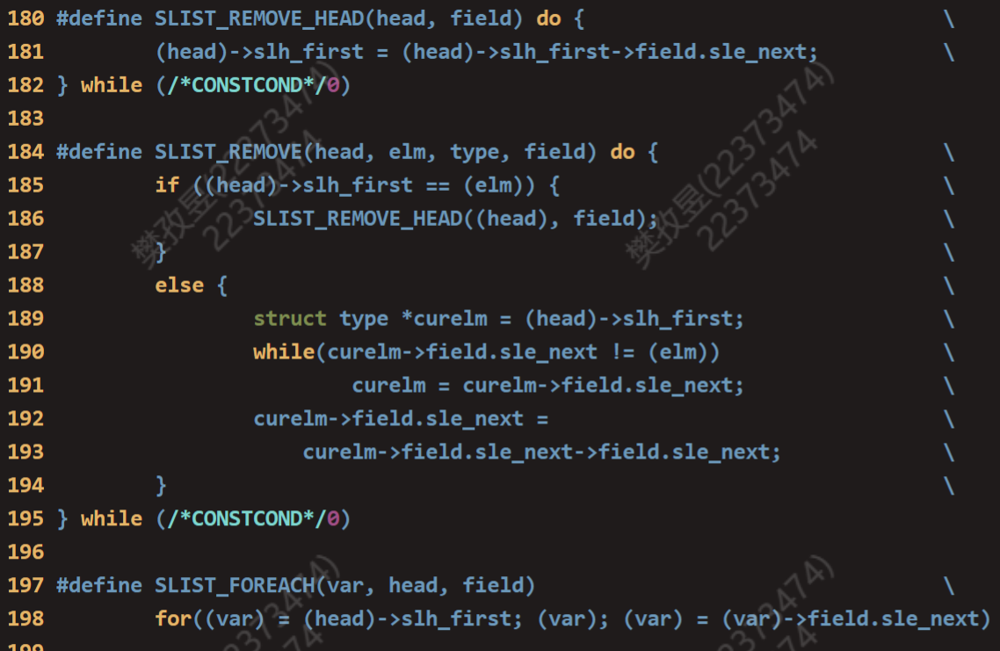
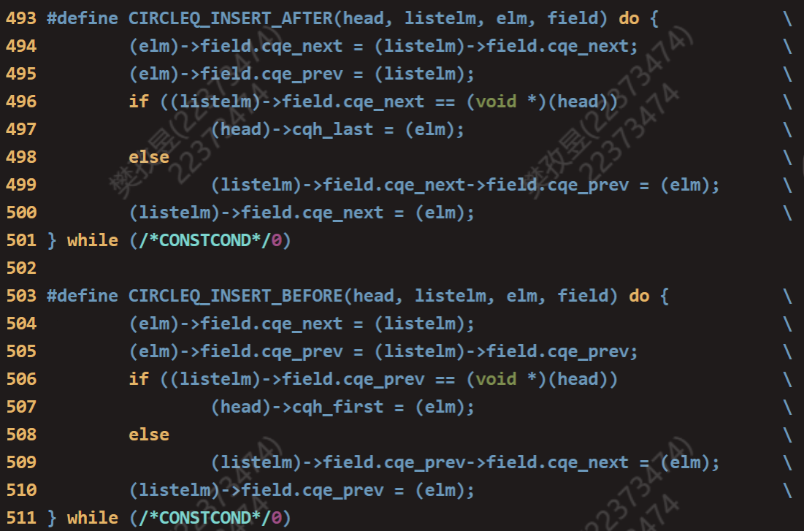
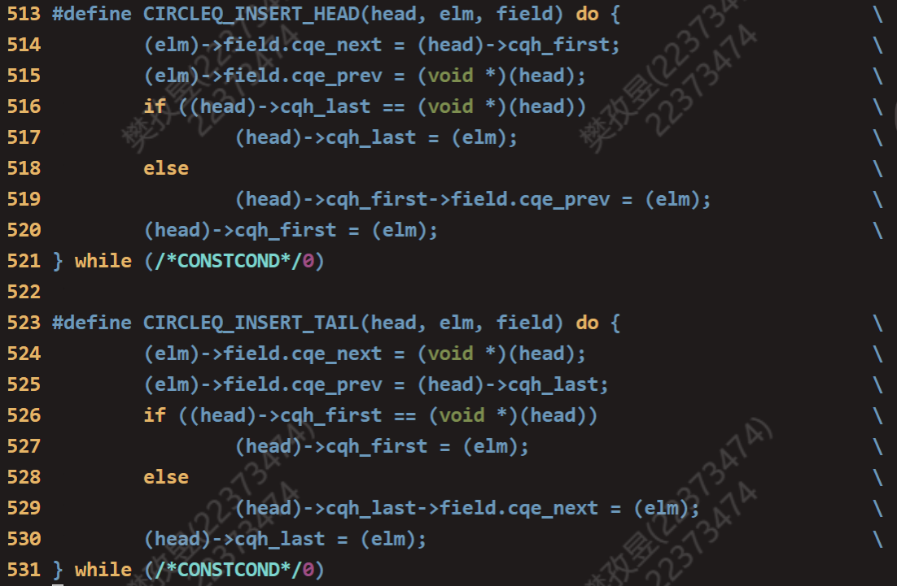
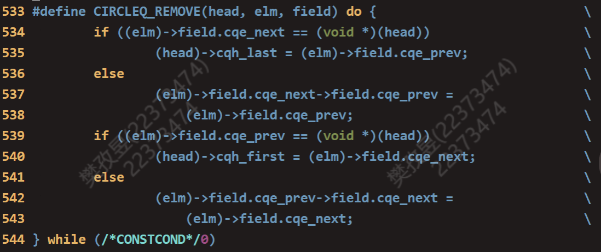
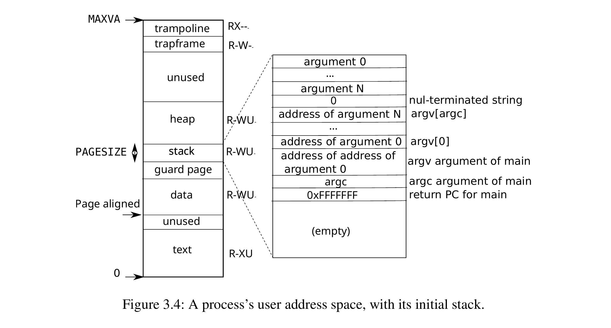
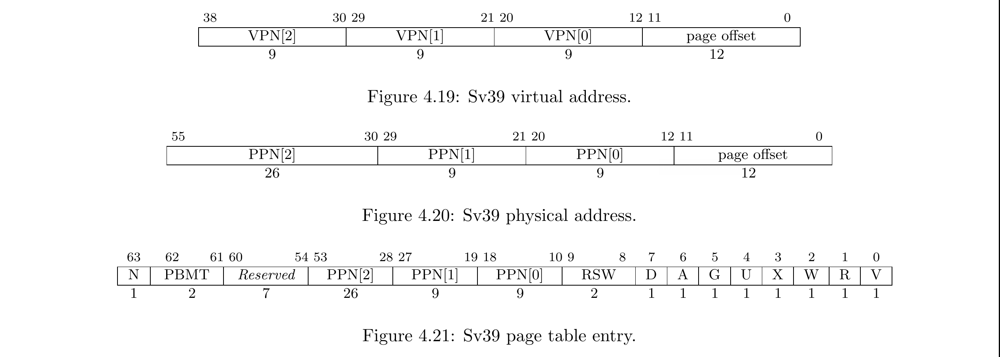
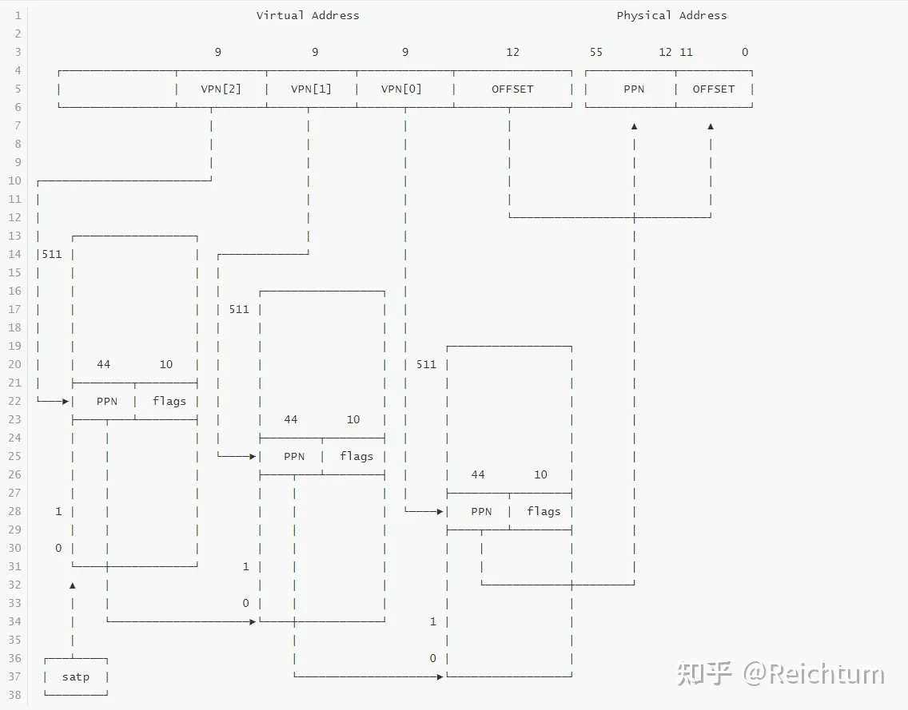
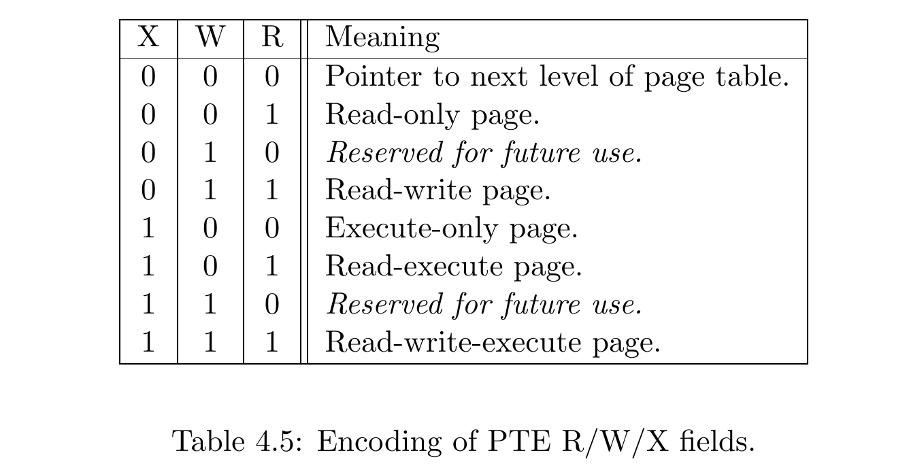

# lab2

## 思考题

### Thinking 2.1

**Q:**请根据上述说明，回答问题：在编写的 C 程序中，指针变量中存储的地址被视为虚拟地址，还是物理地址？MIPS汇编程序中lw和sw指令使用的地址被视为虚拟地址，还是物理地址？

**A:**均为虚拟地址

> 在实际程序中，访存、跳转等指令以及用于取指的PC寄存器中的访存目标地址都是虚拟地址。我们编写的C程序中也经常通过对指针解引用来进行访存，其中指针的值也会被视为虚拟地址，经过编译后生成相应的访存指令。

### Thinking 2.2

**Q:**请思考下述两个问题：

• 从可重用性的角度，阐述用宏来实现链表的好处。 

**A:**指导书中讲“C语言并没有泛型的语法，因此需要通过宏另辟蹊径来实现泛型”。

> 泛型：泛型是 Java SE5 出现的新特性，泛型的本质是**类型参数化或参数化类型**，在不创建新的类型的情况下，通过泛型指定的不同类型来控制形参具体限制的类型。

所以用宏实现链表可以容易地创建某个数据类型的链表，只需要在使用宏时传入对应的数据类型名称即可。故可重用性极高。

• 查看实验环境中的/usr/include/sys/queue.h，了解其中单向链表与循环链表的实现，比较它们与本实验中使用的双向链表，分析三者在插入与删除操作上的性能差异。

**A:**

双向链表：在插入和删除节点时，由于每个节点都有指向前一个节点的指针，可以直接定位目标节点的前一个节点，时间复杂度为O(1)。

> /usr/include/sys/queue.h包含以下几种数据结构：
>
> 1. 双链表（List）
> 2. 单链表（Singly-linked List）
> 3. 单链尾队列（Singly-linked Tail queue）
> 4. 简单队列（Simple queue）
> 5. 双链尾队列（Tail queue）
> 6. 循环队列（Circular queue）





单向链表：对于单纯的插入和删除操作只有O(1)的时间复杂度。但是单向链表在插入和删除节点时，需要遍历链表找到目标节点的前一个节点，因此时间复杂度为O(n)。







循环链表：

+ 单向循环链表：需要遍历链表找到目标节点的前一个节点，时间复杂度会为O(n)。

+ 双向循环链表：每个节点都有指向前一个节点和下一个节点的指针，时间复杂度会为O(1)。

### Thinking 2.3

**Q:**请阅读include/queue.h以及include/pmap.h,将Page_list的结构梳 理清楚，选择正确的展开结构。

**A:**C

```c
struct Page_list {
    struct Page {
        struct {                                                         
			struct page *le_next;  /* next element */                     
			struct page **le_prev; /* address of previous next element */ 
        } pp_link;
        u_short pp_ref;
    } *lh_fist;
}
```

```c
//pmap.h
LIST_HEAD(Page_list, Page);

//queue.h
#define LIST_HEAD(name, type) \
	struct name { \
		struct type *lh_first; /* first element */ \
	}

//pmap.h
struct Page {
	Page_LIST_entry_t pp_link; /* free list link */

	// Ref is the count of pointers (usually in page table entries)
	// to this page.  This only holds for pages allocated using
	// page_alloc.  Pages allocated at boot time using pmap.c's "alloc"
	// do not have valid reference count fields.

	u_short pp_ref;
};

//pmap.h
typedef LIST_ENTRY(Page) Page_LIST_entry_t;

//queue.h
#define LIST_ENTRY(type) \
	struct { \
		struct type *le_next;  /* next element */ \
		struct type **le_prev; /* address of previous next element */ \
	}
```

### Thinking 2.4

**Q:**请思考下面两个问题：

• 请阅读上面有关TLB的描述，从虚拟内存和多进程操作系统的实现角度，阐述ASID 的必要性。 

**A:**在多进程操作系统中，每个进程都有自己独立的虚拟地址空间，ASID可以帮助区分不同进程的TLB缓存条目。这样，当操作系统切换上下文到另一个进程时，可以清除或刷新TLB中与上一个进程相关的转换信息，避免出现地址空间混乱。

• 请阅读 MIPS 4Kc 文档《MIPS32® 4K™ Processor Core Family Software User’s Manual》的 Section 3.3.1 与 Section 3.4，结合 ASID 段的位数，说明 4Kc 中可容纳 不同的地址空间的最大数量。

**A:**在 MIPS 4Kc 中，ASID 段有8位，那么它可以容纳的不同地址空间的最大数量为 2^8

### Thinking2.5

**Q:**请回答下述三个问题： 

•tlb_invalidate和tlb_out的调用关系？ 

**A:**tlb_invalidate调用tlb_out，tlb_out是叶子函数

•请用一句话概括tlb_invalidate的作用。 

**A:**删除某个虚拟地址在 TLB 中的旧表项。

•逐行解释tlb_out中的汇编代码。

**A:**

```assembly
LEAF(tlb_out)
.set noreorder
	mfc0    t0, CP0_ENTRYHI
	#存储原有的EnryHi寄存器的值到$t0,用于函数结束时恢复
	mtc0    a0, CP0_ENTRYHI
	#将传入的参数设置为EnryHi新的值
	nop
	tlbp
	#根据EntryHi中的Key(包含VPN与ASID)，查找 TLB 中与之对应的表项，并将表项的索引存入Index寄存器
	nop
	mfc0    t1, CP0_INDEX
	#将tlbp的执行后Index寄存器的结果保存到$t1
.set reorder
	bltz    t1, NO_SUCH_ENTRY
	#Index寄存器中值小于0,表示没有查到该表项
.set noreorder
	mtc0    zero, CP0_ENTRYHI
	mtc0    zero, CP0_ENTRYLO0
	mtc0    zero, CP0_ENTRYLO1
	#将三个寄存器中的值置零方便清空
	nop
	tlbwi
	#以Index寄存器中的值为索引，将此时EntryHi与EntryLo0、EntryLo1的值写到索引指定的TLB表项中
.set reorder

NO_SUCH_ENTRY:
	mtc0    t0, CP0_ENTRYHI
	#恢复调用前EnryHi寄存器的值
	j       ra
	#跳回
END(tlb_out)
```

### Thinking 2.6

**Q:**从下述三个问题中任选其一回答： 

• 简单了解并叙述X86体系结构中的内存管理机制，比较X86和MIPS在内存管理上的区别。 

• 简单了解并叙述RISC-V 中的内存管理机制，比较RISC-V 与 MIPS 在内存管理上的区别。 

• 简单了解并叙述LoongArch 中的内存管理机制，比较 LoongArch 与 MIPS 在内存管理上的区别。

> RISC-V 与 MIPS 在内存管理上的区别

RISC-V提供三种权限模式（MSU），而MIPS只提供内核态和用户态两种权限状态。RISC-V SV39支持39位虚拟内存空间，每一页占用4KB，使用三级页表访存。

>  RISC-V 内存管理机制

#### 内存布局

内存布局定义在/kernel/include/mm/memlayout.h当中

具体内存表如下

##### S-Mode内核地址空间布局

```
    VA_MAX ---------------->+---------------------------+-------0x7f ffff ffff
                            |       TRAMPOLINE          |       BY2PG
    TRAMPOLINE ------------>+---------------------------+-----------------
                            |                           |
    PHYSICAL_MEMORY_END --->+---------------------------+-------0x8800 0000
                            |                           |
    kernelEnd ------------->+---------------------------+-----------------
                            |       Kernel Data         |
    textEnd --------------->+---------------------------+-----------------
                            |       Kernel Text         |
    BASE_ADDRESS, --------->+---------------------------+-------0x8020 0000
    kernelStart -/          |                           |
                            |       OpenSBI             |
    PHYSICAL_MEMORY_BASE -->+---------------------------+-------0x8000 0000
                            |                           |
    ----------------------->+---------------------------+-----------------
                            |       VIRTIO              |
    VIRTIO ---------------->+---------------------------+-------0x1000 1000
                            |                           |
    ----------------------->+---------------------------+-----------------
                            |       UART0               |
    UART0 ----------------->+---------------------------+-------0x1000 0000
                            |                           |
    ----------------------->+---------------------------+-----------------
                            |       PILC                |
    PILC  ----------------->+---------------------------+-------0x0c00 0000
                            |                           |
    ----------------------->+---------------------------+-----------------
                            |       CLINT               |
    CLINT ----------------->+---------------------------+-------0x0200 0000
                            |       invalid memory      |
    0 --------------------->+---------------------------+-------0x0000 0000
```

##### U-Mode用户地址空间布局



#### 虚拟页式管理（Sv39内存布局）

##### 39位有效VA

根据SV-39的约定，对于一个64位的虚拟地址，只使用其低39位来进行地址转换，而高25位不做使用，未来Risc-V有可能用来定义更多的翻译级别。

<aside> 💡 因此该布局下最大的虚拟地址即为(1<<39)-1，也就是0x7f ffff ffff

##### 三级页表机制

Sv39为页式的内存管理，每一页的大小为4kb，即4096bytes。采用三级页表来完成虚拟地址到物理地址的映射。

##### satp寄存器

satp(Supervisor Address Translation and Protection)寄存器是Risc-V架构下的一个特权寄存器，用来告知cpu根页表的地址，其具体布局如下

| 63-60 | 59-44 | 43-0 |
| ----- | ----- | ---- |
| mode  | asid  | ppn  |

- mode用来表示内存布局，这里我们设置为8，告知cpu我们采取Sv-39内存布局方式
- asid为地址空间的id（暂时先不管）
- ppn为页表基地址的物理页号，由于一页大小为4kb，因此即为页表的物理地址右移12位即可

##### 虚拟地址和物理地址

Sv-39的虚拟地址和物理地址格式如下



对于一个虚拟地址而言，VPN[2]为第一级页号，查询过程如下：

- satp寄存器存储了根页表的物理地址，将根页表的物理地址加上页表项大小（8bytes）*第一级页号即可找到其对应表项。
- 表项的布局如上图（Sv39 page table entry），其53-10位为下一级页表（第二级页表）的页号，低10位用作标记位
- 由此获得了第二级页表的基地址（页号左移12位），此时再用VPN[1]去查询第三级页表的基地址即可。
- 如此获得第三级页表项，其存储的页号即为最终对应的物理页号，将其左移12位再加上page offset，就得到了对应的物理地址



###### 页表项的标记位


上述过程已经可以查询到对应的物理地址，但页表项中的标记位也携带了一些额外的信息，下面加以解释

- RSW: Reserved for use by Supervisor softWare
- D: Dirty bit
  - exception: a virtual page is written and the D bit is clear
- A: Accessed bit
  - exception: a virtual page is accessed and the A bit is clear
- 可以将DA 总是设置为 1避免产生上述异常（存疑，qs文档）
- U: User mode bit
  - U-mode 访问许可位
  - S-mode *一般* 不可访问
- For non-leaf PTEs, the D, A, and U bits are reserved for future standard use
- R: Read bit
- W: Write bit
- X: eXecute bit
- RWX 具体作用见下
- V: Valid bit
  - 有效位

在 RISC-V 中，PTE 有两种：

- 叶 PTE：指向一个物理页 PPN
- 非叶 PTE：指向一个页表 PPN

实际上位于任何级的 PTE 都可能成为叶 PTE，也就是不通过三级页表映射就查询到一个物理地址（RX非0）。非最低级的 PTE 作为叶 PTE 时则会形成超级页。

例如，如果第一级页表所查询到的页表项的R位或X位非0，则页表项中的PPN[2]即为物理地址的页号，而此时其一页的大小也对应的为$2^{12+9+9}=2^{30}$bits（此时PPN[1]和PPN[0]都为0，否则抛出异常），也就是1GB，这就是一个超级页。因此Sv-39下页的大小可能为4Kb，2Mb和1Gb。



## 难点分析

### 0.预备知识

在  include/pmap.h 、 include/mmu.h 中： 

+ PDX(va) ：页目录偏移量（查找遍历页表时常用） 
+ PTX(va) ：页表偏移量（查找遍历页表时常用） 
+ PTE_ADDR(pte) ：获取页表项中的物理地址（读取 pte 时常用） 
+ PADDR(kva) ：kseg0 处虚地址  →  物理地址 
+ KADDR(pa) ：物理地址  →  kseg0 处虚地址（读取 pte 后可进行转换） 
+ va2pa(Pde *pgdir, u_long va) ：查页表，虚地址  →  物理地址（测试时常用）
+ pa2page(u_long pa) ：物理地址  →  页控制块（读取 pte 后可进行转换） 
+ page2pa(struct Page *pp) ：页控制块  →  物理地址（填充 pte 时常用）

### 1.MIPS4Kc内存映射布局

|       | 虚拟地址              | 物理地址                | 访问方式         | 用途                       |
| ----- | --------------------- | ----------------------- | ---------------- | -------------------------- |
| kseg2 | 0xc00000000xffffffff  | 通过 TLB 转换成物理地址 | 通过cache 访存   |                            |
| kseg1 | 0xa0000000~0xbfffffff | 虚拟地址的最高 3 位置 0 | 不通过cache 访存 | 可以用于访问外设           |
| kseg0 | 0x80000000~0x9fffffff | 虚拟地址的最高位置0     | 通过cache 访存   | 用于存放内核代码与数据     |
| kuseg | 0x00000000~0x7fffffff | 通过 TLB 转换成物理地址 | 通过cache 访存   | 用于存放用户程序代码与数据 |

### 2.物理内存的管理方法（链表法）

为了使用链表，我们需要定义两个结构 `LIST_HEAD` 和 `LIST_ENTRY`。前者表示链表头或链表本身的类型，后者表示链表中元素的类型。通过宏定义可知，`LIST_HEAD(name, type)` 表示创建一个元素类型为 `type` 的链表，这个链表类型名为 `name`。`LIST_ENTRY(type)` 表示创建一个类型为 `type` 的链表元素。

```c
#define LIST_HEAD(name, type) \
	struct name { \
		struct type *lh_first; /* first element */ \
	}

#define LIST_ENTRY(type) \
	struct { \
		struct type *le_next;  /* next element */ \
		struct type **le_prev; /* address of previous next element */ \
	}
```

### 3.虚拟内存的管理方法（两级页表）

指导书如是说：

> MOS中用PADDR 与KADDR 这两个宏可以对位于kseg0 的虚拟地址和对应的物理地址进行转换。 但是，对于位于kuseg 的虚拟地址，MOS中采用两级页表结构对其进行地址转换。

提及函数及作用：

#### int pgdir_walk(Pde *pgdir, u_long va, int creat, Pte **ppte)

将一级页表基地址pgdir对应的两级页表结构中va虚拟地址所在的二级页表项的指针 存储在 ppte指向的空间上。

> /* 将 va 虚拟地址所在的二级页表项的指针存储在 ppte 指向的空间上
> 	   *ppte = va 虚拟地址所在的二级页表项的指针
> 	         = 二级页表基地址（指向二级页表的指针） + va所对的二级页表项在二级页表的偏移
>
> ```c
> 	*ppte = (Pte *)KADDR(PTE_ADDR(*pgdir_entryp)) + PTX(va);
> 	二级页表基地址（指向二级页表的指针）：
> 	        页目录项     ->   二级页表的物理地址     ->     二级页表的虚拟地址           ->         指向二级页表的指针
> 		(*pgdir_entryp) 到 PTE_ADDR(*pgdir_entryp) 到 KADDR(PTE_ADDR(*pgdir_entryp)) 到 (Pte *)KADDR(PTE_ADDR(*pgdir_entryp))
> 
> 	va所对的二级页表项在二级页表的偏移： PTX(va)	*/
> ```
>


>  \* Post-Condition:
>
>  \*  If we're out of memory, return -E_NO_MEM.
>
>  \*  Otherwise, we get the page table entry, store
>
>  \*  the value of page table entry to *ppte, and return 0, indicating success.

#### int page_insert(Pde \*pgdir,u_int asid,structPage \*pp,u_long va,u_int perm)

将一级页表基地址pgdir对应的两级页表结构中虚拟地址va映射到页控制块pp对应的物理页面，并将页表项权限为设置为perm。

>  \* Post-Condition:
>
>  \*  Return 0 on success
>
>  \*  Return -E_NO_MEM, if page table couldn't be allocated

> If there is already a page mapped at `va`, call page_remove() to release this mapping.

#### struct Page \*page_lookup(Pde \*pgdir,u_long va,Pte **ppt)

返回一级页表基地址pgdir对应的两级页表结构中虚拟地址va映射的物理页面的页控制块，同时将ppte指向的空间设为对应的二级页表项地址。

就是里面有一个pgdir_walk，多一步把va经过页表查询得到的pa转化成Page结构体然后返回。

#### void page_remove(Pde*pgdir,u_intasid,u_longva)

删除一级页表基地址 pgdir对应的两级页表结构中虚拟地址va对物理地址的映射。如果存在这样的映射，那么对应 物理页面的引用次数会减少一次。

注：一级页表项的指针（Pde\*）和二级页表项的指针（Pte\*）的值都是虚拟地址，对他们取值后是为其分配的物理地址。

### 4.TLB清除与重填的流程

tlbr：以 Index 寄存器中的值为索引，读出TLB中对应的表项到EntryHi与EntryLo0、EntryLo1。

tlbwi：以 Index 寄存器中的值为索引，将此时EntryHi与EntryLo0、EntryLo1 的值写到索引指定的TLB表项中。

tlbwr：将 EntryHi 与 EntryLo0、EntryLo1 的数据随机写到一个 TLB 表项中（此处使用Random 寄存器来“随机”指定表项，Random寄存器本质上是一个不停运行的循环计数器）

tlbp：根据EntryHi 中的 Key（包含 VPN 与 ASID），查找 TLB 中与之对应的表项，并将表项的索引存入Index 寄存器（若未找到匹配项，则Index最高位被置1）

### 5.叶子函数和非叶子函数

## 实验体会

### lab2-exam

**题目概要：**统计所有二级页表项中，其对应的物理页框的引用数目大于某个值的二级页表项数目。

**主要思路：**

利用zy学姐博客中的对所有二级页表项的遍历方法，只需完善if判断条件：

```c
	int count = 0;//统计满足条件的页表项的数量
	Pde *pde;
	Pte *pte;
	for (int i = 0; i < 1024; i++) {
		pde = pgdir + i;
		if(!(*pde & PTE_V)) { //当前页目录是否有效
			continue;
		}
	
		for (int j = 0; j< 1024;j++ ){
			pte = (Pte*)KADDR(PTE_ADDR(*pde)) + j;
			if (!(*pte & PTE_V)) { ////当前页表是否有效
				continue;
			}
			/*if判断条件*/
            count++
		}
    }
```

### lab2-extra

**题目概要：**简易版伙伴系统(第一眼还以为是21年那个很难很难的考题)

伙伴系统将高地址划32MB分为数个内存区间，每个内存区间有两种状态：已分配和未分配。每个内存区间的大小只可能是 4KB和8KB。初始，32MB均被化为8KB的内存区间且状态均为未分配。buddy_free_list[0]链表中为存储大小为4KB的空闲空间，buddy_free_list[1]链表中存储大小为8KB的空闲空间。要求实现分配函数 `buddy_alloc` 和释放函数 `buddy_free`

**主要思路：**

分配函数 `buddy_alloc` ：由于只有两种分配空间大小的选择，所以逻辑很简单。

释放函数 `buddy_free`：释放8KB的空间时直接释放，释放4KB的空间时需要遍历buddy_free_list[0]寻找伙伴是否空闲：空闲需要合并后插入buddy_free_list[1]，否则直接插入buddy_free_list[0]。

## Reference

1. https://yanna-zy.gitee.io/2023/04/10/BUAA-OS-2/#post-comment
1. [RISC-V Sv39 虚拟内存总结 - 知乎 (zhihu.com)](https://zhuanlan.zhihu.com/p/626899526)
