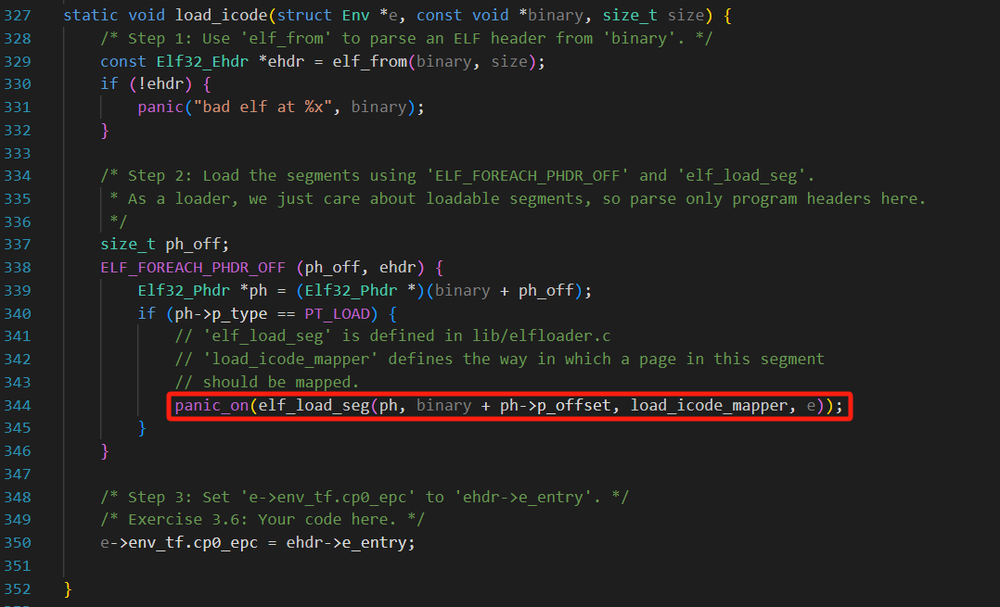
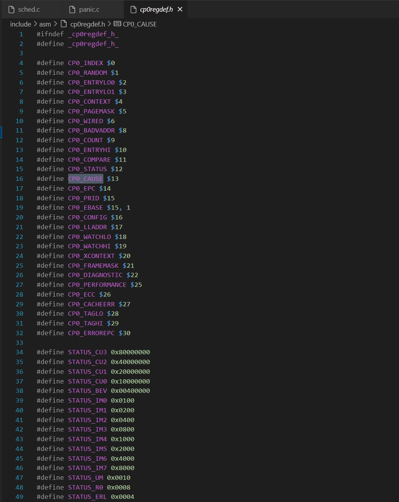

# lab3

## 思考题

### Thinking 3.1

**Q:**请结合MOS中的页目录自映射应用解释代码中`e->env_pgdir[PDX(UVPT)] = PADDR(e->env_pgdir) | PTE_V `的含义。

**A:**

> 指导书原文:
>
> 在两级页表中，一个进程的4GB 地址空间均映射物理内存的话，那么就需要4MB来存放页表（1024个页表），4KB来存放页目录；如果页表和页目录都在进程的地址空间中得到映射，这意味着在1024个页表中，有一个页表所对应的4MB空间就是这1024个页表占用的4MB空间。这一个特殊的页表就是页目录， 它的1024 个表项映射到这1024 个页表。因此只需要4MB的空间即可容纳页表和页目录。

> fzy终于弄懂复述版:
>
> 一个进程的4GB地址空间均映射物理内存。
>
> 一页占据4KB地址，一个进程被分为1M个页(故需要1K个二级页表)，二级页表项组成页目录(页目录是一级页表)。所以采用页表管理机制额外存储的是二级页表，占据4MB空间。

所有进程的地址空间都和mmu.h中的布局一致：UTOP到UVPT是所有进程共享的内核数据，UVPT 到 ULIM 当前进程的页表和页目录。

PDX(UVPT):计算存储页表的起始虚拟地址开始的4MB空间是第几个4MB，即页目录中的第几项

env_pgdir:当前进程页目录的基地址

将 `UVPT` 虚拟地址映射到页目录本身的物理地址，并设置只读权限。(自映射)

### Thinking A.1 

**Q:**在现代的 64 位系统中，提供了 64 位的字长，但实际上不是 64 位页式存储系统。假设在64位系统中采用三级页表机制，页面大小4KB。由于64位系统中字长为 8B，且页目录也占用一页，因此页目录中有512 个页目录项，因此每级页表都需要9位。 因此在64位系统下，总共需要3×9+12=39位就可以实现三级页表机制，并不需要64 位。

现考虑上述39位的三级页式存储系统，虚拟地址空间为512GB，若三级页表的基地址为PTbase，请计算：

+ 三级页表页目录的基地址。 

+ 映射到页目录自身的页目录项（自映射）。

**A:**

PGD（页全局目录）、PMD（页中间目录）和最后一级 PTE（页表）

三级页表对应的页号：PN = PTbase >> 12

三级页表页目录的基地址/二级页表的基地址：PMDbase = PTbase + PN * 8 = PTbase + PTbase >> 9

二级页表对应的页号：PN = PMDbase >> 12

二级页表页目录的基地址/一级页表的基地址：PGDbase = PTbase + PN * 8 = PTbase + PTbase >> 9 + PTbase >> 18 

一级页表对应的页号：PN = PGDbase >> 12

 一级页表页目录的基地址/**映射到页目录自身的页目录项**：PTbase + PTbase >> 9 + PTbase >> 18 + PTbase >> 27 

> 2\^39B存储空间 -> 一页2^12B ->2\^27个三级页表->2\^18个二级页表->2\^9个一级页表->1个一页的页目录
>
> 2\^32B存储空间 -> 一页2^12B ->2\^20个二级页表->2\^10个一级页表->1个一页的页目录

### Thinking3.2

**Q:**elf_load_seg以函数指针的形式，接受外部自定义的回调函数map_page。 请你找到与之相关的data这一参数在此处的来源，并思考它的作用。没有这个参数可不可以？为什么？

**A:**data是在创建进程时分配的进程结构体。目的是在实现段地址映射时，获得进程的页目录和asid，区分不同进程的不同地址空间。不可以没有这个参数，否则无法正确完成地址的映射。

> < VPN, ASID >→< PFN, N, D, V, G >是TLB上的映射关系



### Thinking3.3

结合elf_load_seg的参数和实现，考虑该函数需要处理哪些页面加载的情况。

```c
//需加载到的虚拟地址va不对齐
u_long offset = va - ROUNDDOWN(va, PAGE_SIZE);
	if (offset != 0) {
		if ((r = map_page(data, va, offset, perm, bin,
				  MIN(bin_size, PAGE_SIZE - offset))) != 0) {
			return r;
		}
	}

//经过处理后虚拟地址va对齐，拷贝之后的数据
//需要拷贝的数据长度bin_size可能不页对齐，通过MIN(bin_size - i, PAGE_SIZE)处理
for (i = offset ? MIN(bin_size, PAGE_SIZE - offset) : 0; i < bin_size; i += PAGE_SIZE) {
		if ((r = map_page(data, va + i, 0, perm, bin + i, MIN(bin_size - i, PAGE_SIZE))) !=
		    0) {
			return r;
		}
	}

//bin_size < sgsize需要对剩下的内存空间初始化为0
//sgssize可能不页对齐，同理通过MIN(sgsize - i, PAGE_SIZE)处理
while (i < sgsize) {
		if ((r = map_page(data, va + i, 0, perm, NULL, MIN(sgsize - i, PAGE_SIZE))) != 0) {
			return r;
		}
		i += PAGE_SIZE;
	}
```

### Thinking3.4

> 这里的 env_tf.cp0_epc 字段指示了进程恢复运行时 PC 应恢复到的位置。我们要运行的进程的代码段预先被载入到了内存中，且程序入口为 e_entry，当我们运行进程时，CPU 将自动从 PC 所指的位置开始执行二进制码。

思考上面这一段话，并根据自己在Lab2中的理解，回答：

+ 你认为这里的env_tf.cp0_epc存储的是物理地址还是虚拟地址?

异常程序计数器（Exception Program Counter 简称EPC）。EPC是一个 64 位可读写寄存器,其存储了异常处理完成后继续开始执行的==指令的地址==，自然是虚拟地址。

### Thinking3.5

> 0号异常的处理函数为handle_int，表示中断，由时钟中断、控制台中断等中断造成
>
> 1号异常的处理函数为handle_mod，表示存储异常，进行存储操作时该页被标记为只读 
>
> 2号异常的处理函数为handle_tlb，表示TLBload异常 
>
> 3号异常的处理函数为handle_tlb，表示TLBstore异常 
>
> 8号异常的处理函数为handle_sys，表示系统调用，用户进程通过执行syscall指令陷入内核

**Q:**试找出0、1、2、3号异常处理函数的具体实现位置。8号异常（系统调用）涉及的do_syscall()函数将在Lab4中实现。

**A:**

+ 0号异常

```assembly
#kern/genex.S
NESTED(handle_int, TF_SIZE, zero)
	mfc0    t0, CP0_CAUSE
	mfc0    t2, CP0_STATUS
	and     t0, t2
	andi    t1, t0, STATUS_IM7
	bnez    t1, timer_irq
timer_irq:
	li      a0, 0
	j       schedule
END(handle_int)
```

+ 1、2、3号异常

```assembly
#kern/genex.S
.macro BUILD_HANDLER exception handler
NESTED(handle_\exception, TF_SIZE + 8, zero)
	move    a0, sp
	addiu   sp, sp, -8
	jal     \handler
	addiu   sp, sp, 8
	j       ret_from_exception
END(handle_\exception)
.endm

BUILD_HANDLER tlb do_tlb_refill	#2、3号
#do_tlb_refill以汇编的形式实现，位于kern/tlb_asm.c
BUILD_HANDLER mod do_tlb_mod	#1号
#do_tlb_mod函数位于kern/tlbex.c
```

### Thinking 3.6

**Q:**阅读 entry.S、genex.S 和 env_asm.S 这几个文件，并尝试说出时钟中断在哪些时候开启，在哪些时候关闭。

**A:**

entry.S:在异常处理开始后关闭中断

genex.S:异常处理结束之后开启中断

env_asm.S:运行进程开始时开启时钟中断

### Thinking 3.7

**Q:**阅读相关代码，思考操作系统是怎么根据时钟中断切换进程的。

**A:** 

要进行进程切换，包括以下几种情况：

• 尚未调度过任何进程（curenv 为空指针）；

• 当前进程已经用完了时间片；

• 当前进程不再就绪（如被阻塞或退出）；

• yield 参数指定必须发生切换。

无需进行切换时，我们只需要将剩余时间片长度 count 减去 1，然后调用 env_run 函数，继续运行当前进程 curenv。在发生切换的情况下，我们还需要判断当前进程是否仍然就绪，如果是则将其移动到调度链表的尾部。之后，我们选中调度链表首部的进程来调度运行，将剩余时间片长度设置为其优先级。

## 难点分析

### 函数

+ 进程初始化流程、使用的函数及调用关系

> void env_init
>
> > static void map_segment

> struct Env *env_create
>
> > int env_alloc
> >
> > > int env_setup_vm:初始化新进程的地址空间
>
> > static void load_icode
> >
> > > const Elf32_Ehdr *elf_from
> > >
> > > int elf_load_seg
> > >
> > > > static int load_icode_mapper

+ 进程运行使用的函数及调用关系

> void env_run(struct Env *e)
>
> > void env_pop_tf(struct Trapframe *tf, u_int asid)

#### 用户态/内核态

当且仅当 EXL 被设置为 0 且 UM 被设置为 1 时，处理器处于用户模式，其它所有情况下，处理器均处于内核模式下。每当异常发生的时候，EXL 会被自动设置为 1，并由异常处理程序负责后续处理。而每当执行 eret 指令时，EXL 会被自动设置为 0 。

### 异常处理流程

由于发生异常执行exc_gen_entry通过SAVE_ALL将当前进程的栈指针存在KSTACKTOP以保存当前进程上下文 ，后跳转到相应的异常处理程序，下以时钟中断为例。跳转到handle_int后，如果是时钟中断，执行schedule函数，判断是否需要更换进程，最后调用env_run。在env_run中，保存当前进程上下文 (如果当前没有运行的进程就跳过这一步)，恢复要启动的进程的上下文，然后运行该进程。

## 实验体会

### 课下作业

很容易在作业过程中忘记函数之间的调用关系和作用，作业过程中往往就把关注点只放在了当前函数，需要在完成之后对照指导书中**Lab3** 在 **MOS** 中的概况梳理流程。

### 课上实验

lab3课上实验只看到了exam，与extra还未谋面TAT

exam里要求我们记录`env_runs`,`env_scheds`,`env_clocks`，第一个已经课程组给的代码中完成，第二个只需要在env结构体中添加这个变量并在schedule函数中++予以记录即可，问题主要出在env_clocks的记录。



会发现所有的CP0寄存器都在这个`cp0regdef.h`中被定义，可以用mfc0直接读取。根据课程组的提示我们修改`include/stackframe.h`、`include/trap.h`(一定要记得修改TF_SIZE)，以及需要注意结构体中的变量顺序要和栈的宏定义顺序一致。


上述内容应该就是本次exam最大的思维量了（课程组最最最后提示也把这里的源码给了），我迟迟没有通过的原因还是对schedule函数了解不够清晰，env_clocks没有在正确的时候更新。