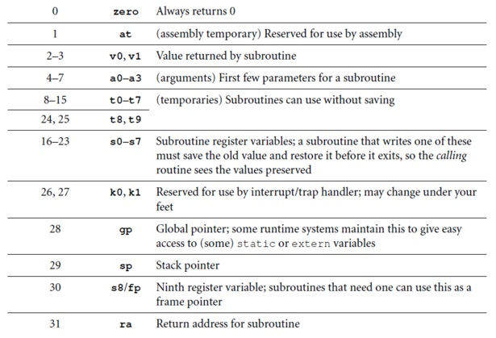
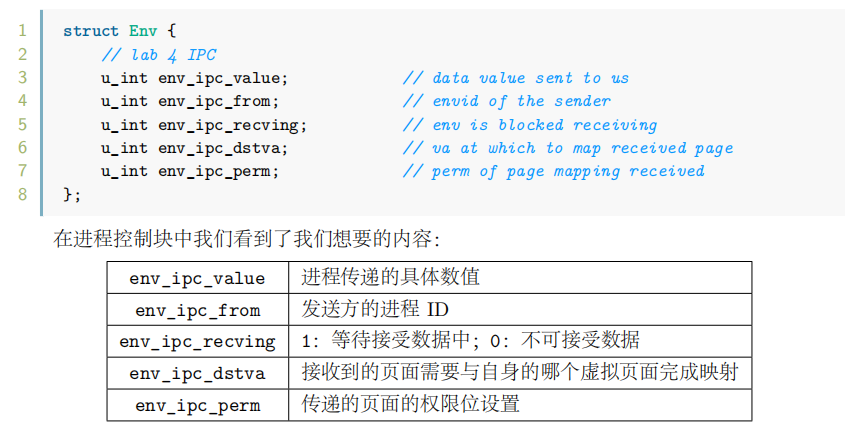
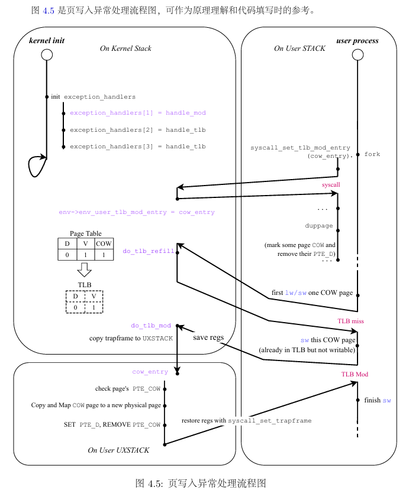
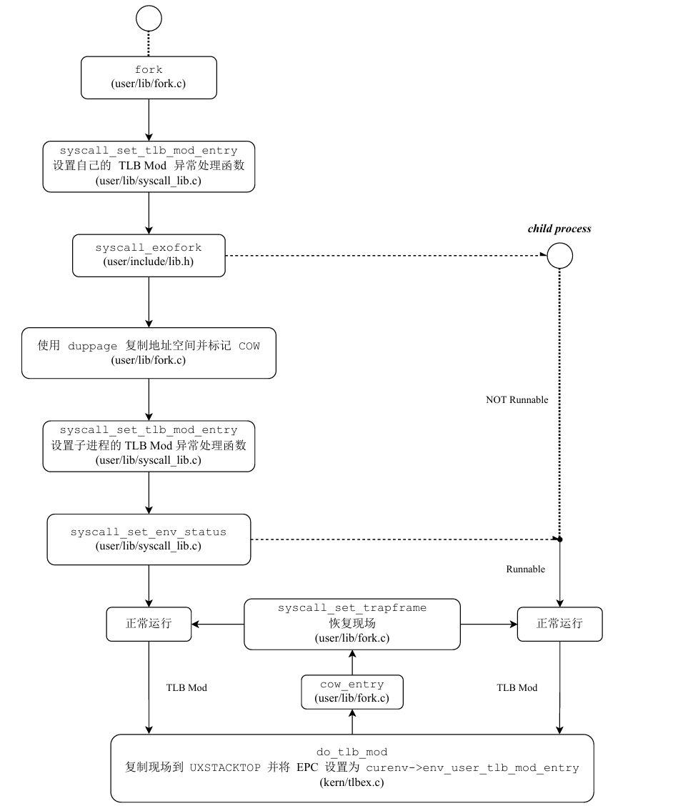

# lab4

## 思考题

### Thinking 4.1 

> 思考并回答下面的问题：
>
> + 内核在保存现场的时候是如何避免破坏通用寄存器的？

**系统从用户态切换到内核态后， 内核首先需要将原用户进程的运行现场保存到内核空间（在 kern/entry.S 中通过 SAVE_ALL 宏完成）。**SAVE_ALL 宏只使用了k0和k1两个通用寄存器来进行操作，所以保证了其他通用寄存器的值都不会被改变。

> + 系统陷入内核调用后可以直接从当时的 a0-a3 参数寄存器中得到用户调用 msyscall留下的信息吗？

以直接读a1-a3寄存器，但不能读a0寄存器。

从用户态调用mysyscall到读取信息发生了下述事件：`msyscall`后系统陷入内核，进入异常分发程序并跳转到`handle_sys`，后调用`do_syscall`并将sp寄存器中的值作为参数传递（更改了a0寄存器）。

> + 我们是怎么做到让 sys 开头的函数“认为”我们提供了和用户调用 msyscall 时同样的参数的？

参数通过栈传递。在内核保存现场时，这些数据都会被保存到内核栈。

> + 内核处理系统调用的过程对 Trapframe 做了哪些更改？这种修改对应的用户态的变化是什么？

tf->cp0_epc指向下一条指令地址，tf->regs[2]（即v0）设为异常处理函数的返回值。

程序返回用户态后能够从正确的位置继续执行，同时也使得用户程序从v0寄存器中获得**系统调用的返回值**。

### Thinking 4.2

> 思考 envid2env 函数: 为什么 envid2env 中需要判断 e->env_id != envid的情况？如果没有这步判断会发生什么情况？

在我们生成envid时，后十位为了方便从envs数组中直接取出Env，可能会有所重叠，envid的独一性取决于mkenvid里不断增长的 i ，所以如果不判断envid是否相同，会取到错误的或者本该被销毁的进程控制块。

😊from:zy学姐

### Thinking 4.3

> 思考下面的问题，并对这个问题谈谈你的理解：请回顾 kern/env.c 文件中 mkenvid() 函数的实现，该函数不会返回 0，请结合系统调用和 IPC 部分的实现与envid2env() 函数的行为进行解释。

```c
u_int mkenvid(struct Env *e) {
	static u_int i = 0;
	return ((++i) << (1 + LOG2NENV)) | (e - envs);
}
```

mkenvid通过i确保每个进程id的唯一且非零。

在envid2env() 函数中，envid为0时表示是curenv。设置该函数中最后一个参数为1时还可以通过检查env_parent_id是不是不为0，来判断是否是子进程以完成一些只能在父子进程间发生系统调用(如销毁进程)或通信的情况。

### Thinking 4.4

>  关于 fork 函数的两个返回值，下面说法正确的是：
>
> A、 fork 在父进程中被调用两次，产生两个返回值
>
> B、 fork 在两个进程中分别被调用一次，产生两个不同的返回值
>
> C、 fork 只在父进程中被调用了一次，在两个进程中各产生一个返回值
>
> D、 fork 只在子进程中被调用了一次，在两个进程中各产生一个返回值 

C

### Thinking 4.5 

> 我们并不应该对所有的用户空间页都使用 duppage 进行映射。那么究竟哪些用户空间页应该映射，哪些不应该呢？请结合 kern/env.c 中 env_init 函数进行的页面映射、include/mmu.h 里的内存布局图以及本章的后续描述进行思考。

`UTOP`和`UVPT`之间储存的是所有进程共享的pages与envs。在执行`env_alloc()`函数时，调用`env_setup_vm`初始化新进程的地址空间，这一部分的映射关系直接从`boot_pgdir`拷贝到进程页表中，不需要进行映射。

`USTACKTOP`和`UTOP`之间是**异常处理栈（user exception stack）和无效内存（invalid memory）**，前者是进行异常处理的地方， 后者一般也不会用到，所以父子进程不需要共享这部分的内存。

所以，最终需要被映射的页面**只有`USTACKTOP`之下的部分**。除此之外，`UVPT`和`ULIM`之间是进程的页表，在映射USTACKTOP之下的部分时会隐式地完成子进程页表的填写，不需要显示地映射父进程的页表。

### Thinking 4.6

> 在遍历地址空间存取页表项时你需要使用到 vpd 和 vpt 这两个指针，请参考 user/include/lib.h 中的相关定义，思考并回答这几个问题：

> • vpt 和 vpd 的作用是什么？怎样使用它们？

`vpt`：指向用户页表基地址的指针

==以vpt为基地址，加上页表项偏移数即可指向va对应的页表项，即vpt[va >> 12] 即 vpt[VPN(va)]；==

`vpd`：指向用户页目录基地址的指针

以vpd为基地址，加上页目录项偏移数即可指向va对应页目录项，即 vpd[va >> 22]；

```c
//user/include/lib.h
#define vpt ((const volatile Pte *)UVPT)
#define vpd ((const volatile Pde *)(UVPT + (PDX(UVPT) << PGSHIFT)))
```
> • 从实现的角度谈一下为什么进程能够通过这种方式来存取自身的页表？

之前在lab3中实现了自映射
```c
static int env_setup_vm(struct Env *e) {
	//...
    //lab3中实现了自映射
	/* Step 3: Map its own page table at 'UVPT' with readonly permission.
	 * As a result, user programs can read its page table through 'UVPT' */
	e->env_pgdir[PDX(UVPT)] = PADDR(e->env_pgdir) | PTE_V;
	return 0;
}
```
> • 它们是如何体现自映射设计的？

vpd的地址在UVPT和UVPT + PDMAP之间，说明将页目录映射到了某一页表位置。一个页表都被页目录中的一个页表项所映射。因此"页目录被映射到某一个页表的位置"就意味着，**在页目录中一定有一个页表项映射到了页目录本身**，即实现了自映射。

> from:hyggge

> • 进程能够通过这种方式来修改自己的页表项吗？

不能，在`env_setup_vm`函数中对页目录只有只读权限。

### Thinking 4.7 

> 在 do_tlb_mod 函数中，你可能注意到了一个向异常处理栈复制 Trapframe运行现场的过程，请思考并回答这几个问题：
>
> • 这里实现了一个支持类似于“异常重入”的机制，而在什么时候会出现这种“异常重入”？

用户态的页写入异常处理函数是用户态程序自行指定的，虽然MOS中的页写入异常处理函数`cow_entry`只对异常处理栈所在的页进行了写操作，不会出现异常重入，但用户自行指定的函数却可能会发生写入COW标记页面而发生异常重入。
> • 内核为什么需要将异常的现场 Trapframe 复制到用户空间？

异常的处理是在用户态进行的，用户态把异常处理完毕后仍然在用户态恢复现场，所以需要把内核保存的现场保存在用户空间的用户异常栈。


### Thinking 4.8

> 在用户态处理页写入异常，相比于在内核态处理有什么优势？ 
> 

解放内核，不用内核执行大量的页面拷贝工作；
内核态处理失误产生的影响较大，可能会使得操作系统崩溃；
用户状态下不能得到一些在内核状态才有的权限，避免改变不必要的内存空间；
更灵活的处理方式，可以根据具体的应用需求进行自定义的异常处理逻辑

### Thinking 4.9 

> 请思考并回答以下几个问题：
>
> • 为什么需要将 syscall_set_tlb_mod_entry 的调用放置在 syscall_exofork 之前？

不是必须要把syscall_set_tlb_mod_entry 的调用放置在 syscall_exofork 之前，只要保证在写时复制保护机制完成之前设置好即可。

> • 如果放置在写时复制保护机制完成之后会有怎样的效果？

父进程运行时在函数调用等情形下会修改栈。在栈空间的页面标记为写时复制之后，父进程继续运行并修改栈，就会触发 TLB Mod 异常。所以在写时复制保护机制完成之前就需要 `syscall_set_tlb_mod_entry`。

## 难点分析

### do_syscall 函数的包装 

```c
// kern/genex.S
.macro BUILD_HANDLER exception handler
NESTED(handle_\exception, TF_SIZE + 8, zero)
	move    a0, sp
	addiu   sp, sp, -8
	jal     \handler
	addiu   sp, sp, 8
	j       ret_from_exception
END(handle_\exception)
.endm
    
BUILD_HANDLER sys do_syscall
```

 lab0预习教程中LEAF和NESTED的宏定义

```c
#define LEAF(symbol)                        \
    .globl  symbol;                         \
    .align  2;                              \
    .type   symbol,@function;               \
    .ent    symbol;                         \
    symbol:                                 \
    .frame  sp,0,ra

#define NESTED(symbol, framesize, rpc)      \
    .globl  symbol;                         \
    .align  2;                              \
    .type   symbol,@function;               \
    .ent    symbol,0;                       \
    symbol:                                 \
    .frame  sp, framesize, rpc
```
+ 第一行是对 LEAF 宏的定义，后面括号中的 symbol 类似于函数的参数，在宏定义中的作用类似，编译时在宏中会将 symbol 替换为实际传入的文本，也即我们的函数名。
+ 第二行中，.globl 的作用是“使标签对链接器可见”，这样即使在其它文件中也可 以引用到 symbol 标签，从而使得其它文件中可以调用我们使用宏定义声明的函数。
+ 第三行中，.align 2 的作用是“使下面的数据进行地址对齐”，这一行语句使得下面的 symbol 标签按 4 Byte 进行对齐，从而使得我们可以使用 jal 指令跳转到这个函数（末尾拼接两位 0）。
+ 第四行中，.type 的作用是设置 symbol 标签的类别，在这里我们设置了 symbol 标签为函数标签。
+ 第五行中，.ent 的作用是标记每个函数的开头，需要与 .end 配对使用。这些标记使得可以在 Debug 时查看调用链

`LEAF` 宏和 `NESTED` 宏的区别就在于 **`LEAF` 宏定义的函数在被调用时没有分配栈帧的空间记录自己的“运行状态”，`NESTED` 宏在被调用时分配了栈帧的空间用于记录自己的“运行状态”**。

```c
#define END(function)                       \
    .end    function;                       \
    .size   function,.-function
```

+ 第一行是对 `END` 宏的定义，与上面 `LEAF` 与 `NESTED` 类似。

+ 第二行的 `.end` 是为了与先前 `LEAF` 或 `NESTED` 声明中的 `.ent` 配对，标记了 `symbol` 函数的结束。

+ 第三行的 `.size` 是标记了 `function` 符号占用的存储空间大小，将 `function` 符号占用的空间大小设置为 `.-function`，`.` 代表了当前地址，当前位置的地址减去 `function` 标签处的地址即可计算出符号占用的空间大小。

### 系统调用时用户和内核中都发生了什么

`syscall_* `的函数：用户空间中最接近的内核的函数

`sys_*` 的函数：内核中系统调用的具体实现部分

`syscall_*`的函数与内核中的系统调用函数（`sys_*` 的函数）是一一对应的

`syscall_*` 的函数的实现中，都调用了 `msyscall `函数，而且函数的第一个参数都是一个与调用名相似的宏（如SYS_print_cons），在我们的 MOS 操作系统实验中把这个参数称为==系统调用号==，它们被定义在 include/syscall.h中。==系统调用号==是内核区分不同系统调用的唯一依据。  

#### `debugf` 和相关函数的调用关系：

> user/lib/debugf.c
>
> `debugf -> vdebugf -> vprintfmt -> debug_output -> debug_flush`
>
> user/lib/syscall_lib.c
>
> `-> syscall_print_cons->msyscall`


> kern/genex.S
>
> `handle_sys`  
>
> kern/syscall_all.c
>
> `do_syscall`
>
> kern/syscall_all.c
>
> `sys_*`  


> msyscall 函数一共有 6 个参数，前 4 个参数会被 syscall_* 的函数分别存入 a0-a3 寄存器（寄存器传参的部分）同时栈帧底部保留 16 字节的空间（不要求存入参数的值），后 2 个参数只会被存入在预留空间之上的 8 字节空间内（没有寄存器传参），于是总共 24 字节的空间用于参数传递。
>
> C 代码中的这些调用过程会由编译器自动编译为汇编代码，而我们在内核中则需要显式地从保存的用户上下文中获取函数的参数值。  

Lab3 里面中断异常处理的行为：

1. 处理器跳转到异常分发代码处(kern/entry.S)
2. 进入异常分发程序，根据 cause 寄存器值判断异常类型并跳转到对应的处理程序(genex.S/handle_x)
3. 处理异常，并返回

### 32个寄存器



### 进程间通信Env控制块相关信息



+ int sys_ipc_recv(u_int dstva)

+ int sys_ipc_try_send(u_int envid, u_int value, u_int srcva, u_int perm)

 		srcva 为 0 的调用表示只传 value 值，而不需要传递物理页面；不为 0 时，才建立两个进程的页面映射关系。

+ 进程链表相关

```c
1. 空闲进程控制块链表env_free_list -> env_link
	获取第一个: e = LIST_FIRST(&env_free_list);
	遍历: LIST_FOREACH(e, &env_free_list, env_link);
	开头插入: LIST_INSERT_HEAD(&env_free_list, e, env_link);
	移除: LIST_REMOVE(e, env_link);
2. 调度进程队列链表env_sched_list -> env_sched_link
	获取第一个: e = TAILQ_FIRST(&env_sched_list);
	遍历: TAILQ_FOREACH(e, &env_sched_list, env_sched_link);
	开头插入: TAILQ_INSERT_HEAD(&env_sched_list, e, env_sched_link);
	结尾插入: TAILQ_INSERT_HEAD(&env_sched_list, e, env_sched_link);
	移除: TAILQ_REMOVE(&env_sched_list, e, env_sched_link);
```


### fork相关

#### 涉及函数

• kern/syscall_all.c： `sys_exofork`， `sys_set_env_status` ， `sys_set_tlb_mod_entry`

• kern/tlbex.c： `do_tlb_mod` 负责完成写时复制处理==前==的相关设置

• user/lib/fork.c：

+ `fork`
+ `cow_entry` ：写时复制处理的函数，也是内核会从 `do_tlb_mod`返回到的函数，负责对带有 PTE_COW 标志的页面进行处理
+ `duppage` ：父进程对子进程页面空间进行映射以及相关标志设置的函数

#### 函数调用关系



fork函数流程：



---

• user/lib/entry.S：用户进程的入口

• user/lib/libos.c：用户进程入口的 C 语言部分，负责完成执行用户程序 main 前后的准备和清理工作

• kern/genex.S：该文件实现了 MOS 的异常处理流程，虽然不是我们需要实现的重点，但是建议读者认真阅读，理解中断处理的流程。

## 实验体会

lab4-1：exam考察增加系统调用指令
lab4-2：exam考察父子进程之间的IPC通信，extra背景是内核控制的进程程。

感觉难点还是要熟悉系统调用的流程，准确认识到什么时候在用户态什么时候在内核态。(添加系统调用需要改变的文件一定要熟知啊)

除此之外就是掌握IPC、fork相关函数作用及对应参数的含义，以便运用。
