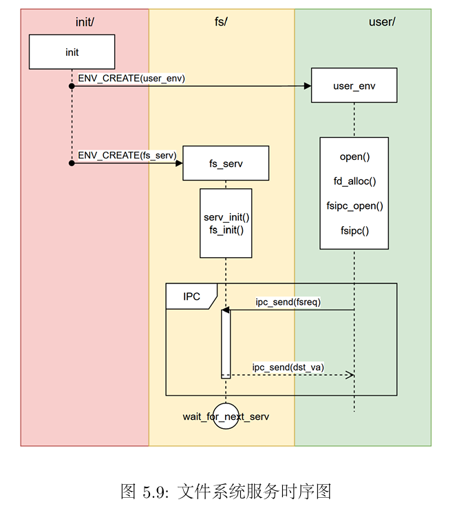
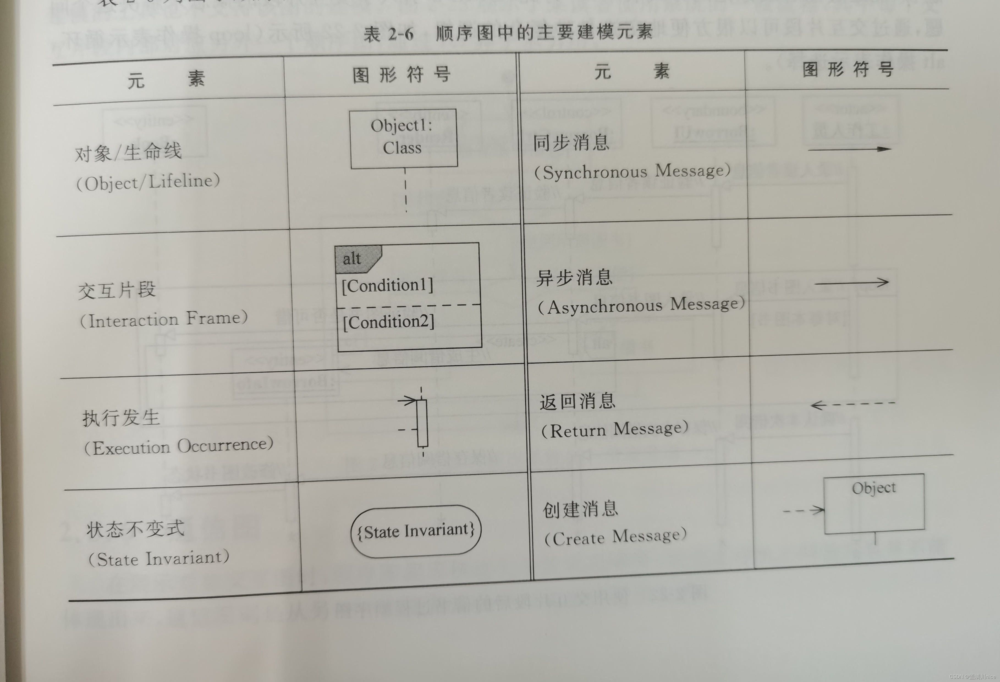
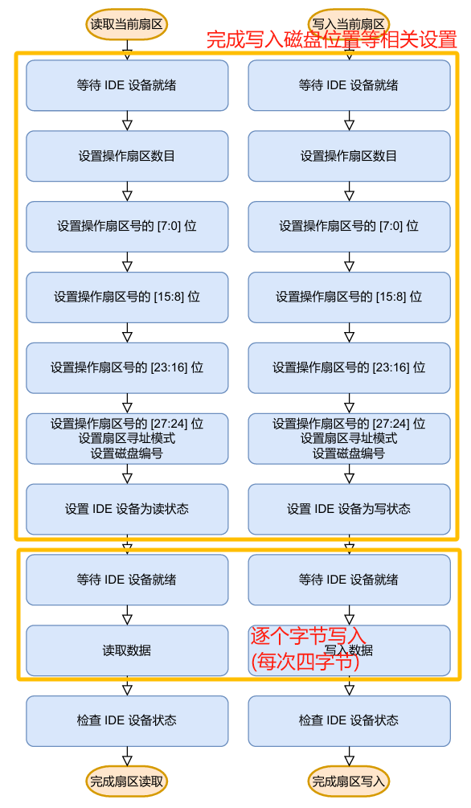
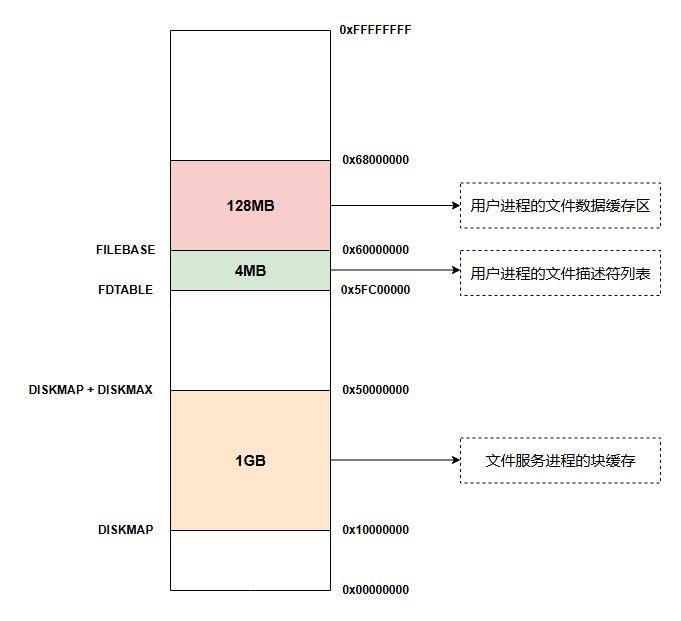
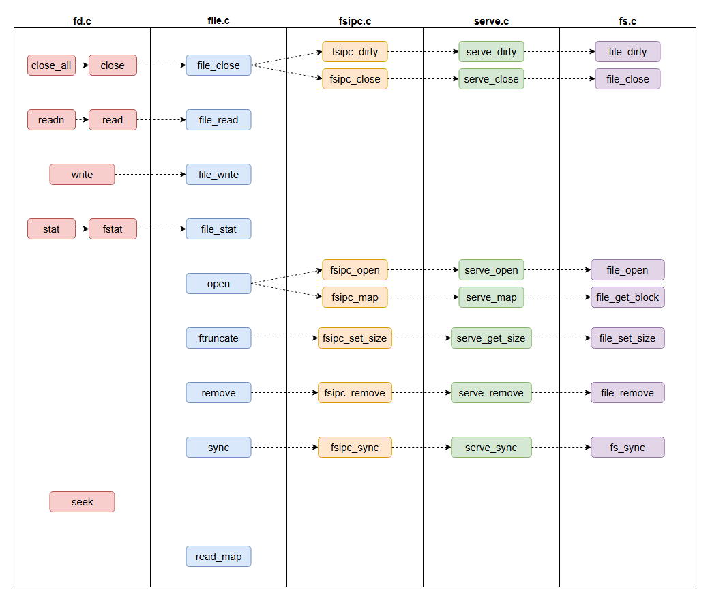

# lab5

## 思考题

### Thinking 5.1

> 如果通过 kseg0 读写设备，那么对于设备的写入会缓存到 Cache 中。这是一种错误的行为，在实际编写代码的时候这么做会引发不可预知的问题。请思考：这么做这会引发什么问题？对于不同种类的设备（如我们提到的串口设备和IDE磁盘）的操作会有差异吗？可以从缓存的性质和缓存更新的策略来考虑。

当外部设备自身更新数据时，如果此时CPU写入外设的数据还只在缓存中，**则缓存的那部分数据就只能在外设自身更新后再写入外设**（只有缓存块将要被新进入的数据取代时，缓存数据才会被写入内存），这样就会发生错误的行为。

==设备物理内存处的数据不只由 CPU 决定，还和对应的外设的行为有关。而缓存只能记录 CPU 的读写结果，无法在外设对数据进行修改时及时调整。==

串口设备读写频繁，而IDE磁盘读写频率相对较小，因此串口设备发生错误的概率要远大于IDE磁盘。

> from Hyggge :)

### Thinking 5.2

> 查找代码中的相关定义，试回答一个磁盘块中最多能存储多少个文件控制块？一个目录下最多能有多少个文件？我们的文件系统支持的单个文件最大为多大？

```c
// user/include/fs.h

// 一个磁盘块的容量为4KB
#define BLOCK_SIZE PAGE_SIZE
// 文件控制块都被数组f_pad强制对齐为256B
struct File {
	char f_name[MAXNAMELEN]; // filename
	uint32_t f_size;	 // file size in bytes
	uint32_t f_type;	 // file type
	uint32_t f_direct[NDIRECT];
	uint32_t f_indirect;

	struct File *f_dir; // the pointer to the dir where this file is in, valid only in memory.
	char f_pad[FILE_STRUCT_SIZE - MAXNAMELEN - (3 + NDIRECT) * 4 - sizeof(void *)];
} __attribute__((aligned(4), packed));
#define FILE2BLK (BLOCK_SIZE / sizeof(struct File))
```

+ 一个磁盘块中最多能存储16个文件控制块
+ 一个目录下最多能有4KB/4B * 16 = 1024*16 = 16384个文件
+ 单个文件最大为4KB/4B * 4KB = 4MB

### Thinking 5.3

> 请思考，在满足磁盘块缓存的设计的前提下，我们实验使用的内核支持的最 大磁盘大小是多少？

块缓存所在的地址空间为`[0x10000000, 0x50000000)`,因此我们的内核能够支持的磁盘大小为`0x40000000`,也就是1GB。

### Thinking 5.4

> 在本实验中，fs/serv.h、user/include/fs.h 等文件中出现了许多宏定义， 试列举你认为较为重要的宏定义，同时进行解释，并描述其主要应用之处。

```c
// fs/serv.h
#define SECT_SIZE 512			  /* Bytes per disk sector */
#define SECT2BLK (BLOCK_SIZE / SECT_SIZE) /* sectors to a block */

/* Disk block n, when in memory, is mapped into the file system
 * server's address space at DISKMAP+(n*BLOCK_SIZE). */
#define DISKMAP 0x10000000

/* Maximum disk size we can handle (1GB) */
#define DISKMAX 0x40000000
```
```c
// user/include/fs.h
// Bytes per file system block - same as page size
#define BLOCK_SIZE PAGE_SIZE
#define BLOCK_SIZE_BIT (BLOCK_SIZE * 8)

// Number of (direct) block pointers in a File descriptor
#define NDIRECT 10
#define NINDIRECT (BLOCK_SIZE / 4)

#define MAXFILESIZE (NINDIRECT * BLOCK_SIZE)

#define FILE_STRUCT_SIZE 256
```

```c
// user/include/fd.h 
// 找fd对应的文件信息页面和文件缓存区地址
#define INDEX2FD(i) (FDTABLE + (i)*BY2PG)
#define INDEX2DATA(i) (FILEBASE + (i)*PDMAP)
```
### Thinking 5.5

> 在Lab4“系统调用与fork”的实验中我们实现了极为重要的fork函数。那 么fork前后的父子进程是否会共享文件描述符和定位指针呢？请在完成上述练习的基础上编写一个程序进行验证。

一个进程所有的文件描述符都存储在`[FDTABLE, FILEBASE)`这一地址空间中。在`fork`函数执行时，会将这父进程页表中映射一部分地址的页表项拷贝到子进程的页表中，因此`fork`前后的父子进程会共享文件描述符和定位指针。

### Thinking 5.6

> 请解释File,Fd,Filefd结构体及其各个域的作用。比如各个结构体会在哪些过程中被使用，是否对应磁盘上的物理实体还是单纯的内存数据等。说明形式自定，要求简洁明了，可大致勾勒出文件系统数据结构与物理实体的对应关系与设计框架。

```c
// usr/include/fd.h
// file descriptor
struct Fd {
	u_int fd_dev_id;	// 外设id
	u_int fd_offset;	// 读写偏移量
	u_int fd_omode;		// 打开方式
};
// file descriptor + file
struct Filefd {
	struct Fd f_fd;
	u_int f_fileid;		// 文件id
	struct File f_file;	// 对应文件的文件控制块
};
```

Fd结构体主要用于记录已打开文件的状态，便于用户直接使用文件描述符对文件进行操作、申请服务等等。由于文件描述符主要是为用户所使用，因此它对应的是磁盘映射到内存中的数据。

+ fd_dev_id:不同的dev_id会调取不同的文件服务函数
+ fd_offset:seek()时修改 offset会被用来找起始filebno文件块号
+ fd_omode:req和open结构体都会用到

文件描述符中存储的数据毕竟是有限的，有的时候我们需要将`Fd*`强制转换为`Filefd*`从而获取到文件控制块，从而获得更多文件信息，比如文件大小等等。Fd和Field只是对一个位置上的数据不同的解释方式。

```c
// usr/include/fs.h
struct File {
	char f_name[MAXNAMELEN]; // filename
	uint32_t f_size;	 // file size in bytes
	uint32_t f_type;	 // file type
	uint32_t f_direct[NDIRECT];	// 文件的直接指针,用来记录文件的数据块在磁盘上的位置
	uint32_t f_indirect;	// 指向一个间接磁盘块，用来存储指向文件内容的磁盘块的指针

	struct File *f_dir; // the pointer to the dir where this file is in, valid only in memory.
	char f_pad[FILE_STRUCT_SIZE - MAXNAMELEN - (3 + NDIRECT) * 4 - sizeof(void *)];
} __attribute__((aligned(4), packed));
```


### Thinking 5.7



> 图 5.9 中有多种不同形式的箭头，请解释这些不同箭头的差别，并思考我们 的操作系统是如何实现对应类型的进程间通信的。



fs_serv循环调用`ipc_recv`函数，在这个函数被调用后，fs_serv就会主动让出CPU（进程状态被标记为`NOT_RANNABLE`）。直到user_env调用`ipc_send`向fs_serv申请服务，fs_serv被唤醒，后user_serv调用`ipc_recv`，user_serv让出cpu。fs_serv处理结束后，fs_serv调用`ipc_send`唤醒user_env。fs_serv进入下一次循环，调用`ipc_recv`重复上述过程。

## 难点分析

### 重要函数

1. 了解文件系统的基本概念和作用。 
2. 了解普通磁盘的基本结构和读写方式。 
3. 了解实现设备驱动的方法。 
4. 掌握并实现文件系统服务的基本操作。 
5. 了解微内核的基本设计思想和结构。

补充lab4相关：接收方进程先recv发送方进程才能成功发送

`u_int ipc_recv(u_int *whom, void *dstva, u_int *perm)`

if (whom) -> *whom为所收到消息的发送方id

if(perm) -> *perm为收到信息的权限

dstva：接受消息的地址；返回值为发送的值

`int sys_ipc_recv(u_int dstva)`

设置当前进程env_ipc_recving为1，env_ipc_dstvs为dstva，env_status为ENV_NOT_RUNNABLE并插入对应进程队列，返回成功发送/错误值


`void ipc_send(u_int whom, u_int val, const void *srcva, u_int perm) `

调用sys_ipc_try_send

`int sys_ipc_try_send(u_int envid, u_int value, u_int srcva, u_int perm)`

向envid进程发送value(srcva不为零时向接收方进程的env_ipc_dstvs插入一页)，返回成功发送/错误值

#### /kern

##### syscall_all.c

> ```c
> int sys_write_dev(u_int va, u_int pa, u_int len);
> int sys_read_dev(u_int va, u_int pa, u_int len);
> ```

#### /tools :存放的是构建时辅助工具的代码。

##### fsformat.c：创建磁盘镜像。

> ```c
> void write_directory(struct File *dirf, char *path);
> void write_file(struct File *dirf, const char *path);
> //将宿主机上路径为path的【目录（及其下所有目录和文件）/文件】写入磁盘镜像中drif所指向的文件控制块所代表的目录下
> struct File create_file(struct File *dirf);
> //在给定目录下分配新的文件控制块
> ```

  请注意，tools目录下的代码仅用于MOS的构建，在宿主Linux环境（而非 MIPS 模拟器）中运行，也不会被编译进MOS的内核、用户库或用户程序中。 

#### /fs :存放的是文件系统服务进程的代码。

##### fs.c：实现文件系统的基本功能函数

> 在文件系统服务进程中实现磁盘块与内存空间之间的映射。我们需要管理缓冲区内的内存。
>
> ```c
> void * disk_addr(u_int blockno);  
> //将数据块编号转换为缓冲区范围内的对应虚拟地址 
> int map_block(u_int blockno);
> //分配映射磁盘块需要的物理页面(若已经建立了映射，直接返回0)
> void unmap_block(u_int blockno);
> //释放用来映射磁盘块的物理页面(not free but dirty时写回)
> int dir_lookup(struct File *dir, char *name, struct File **file);
> //在dir指向的文件控制块所代表的目录下寻找名为name的文件。
> ```

##### ide.c：通过系统调用与磁盘镜像进行交互

> ```c
> static u_int wait_ide_ready();
> void ide_read(u_int diskno, u_int secno, void *dst, u_int nsecs);
> void ide_write(u_int diskno, u_int secno, void *src, u_int nsecs);
> /*
>  *  diskno: disk number.
>  *  secno: start sector number.
>  *  dst: destination for data read from IDE disk.
>  *  nsecs: the number of sectors to read.
>  */
> ```


##### serv.c：该进程的主干函数(文件系统服务进程的入口)

通过IPC通信与用户进程 user/lib/fsipc.c 内的通信函数进行交互。 

#### /user/lib :存放了用户程序的库函数。

##### fsipc.c：实现了与文件系统服务进程的交互(文件系统服务进程的接口)

>```c
>static int fsipc(u_int type, void *fsreq, void *dstva, u_int *perm);
>```

##### file.c：实现了文件系统的用户接口

> ```c
> int open(const char *path, int mode);
> ```


##### fd.c：实现了文件描述符，允许用户程序使用统一的接口，抽象地操作磁盘文件系统中的文件，以及控制台和管道等虚拟的文件。

> ```c
> int read(int fdnum, void *buf, u_int n);
> ```

### 磁盘驱动

`ide.c`



### 文件系统的地址空间布局



### 文件进程和用户进程的交互



## 实验体会

lab5文件系统需要阅读理解多个文件夹下多个代码文件，理解进程间通信及复杂嵌套一样层层的函数调用，还有文件系统本身设计的一些小巧思，理解起来真的好难（这个lab真的是感觉上最难的一个啊）。除此之外，文件系统也作为一个进程是我第一次真切体悟到MOS微内核的感觉。个人课下理解仍然不到位，导致lab5课上测试结果也并不好，os上机也结束了，虽然上机过程和结果都不算预约，但是操作系统无罪，还是得感叹操作系统真的好精妙啊。
