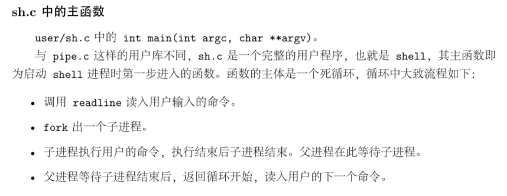
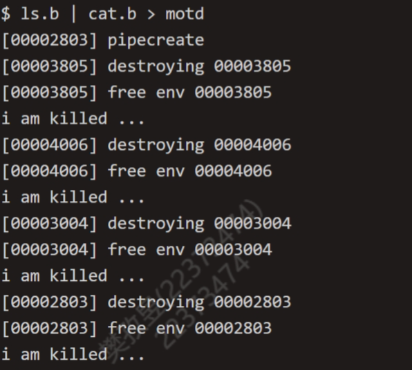
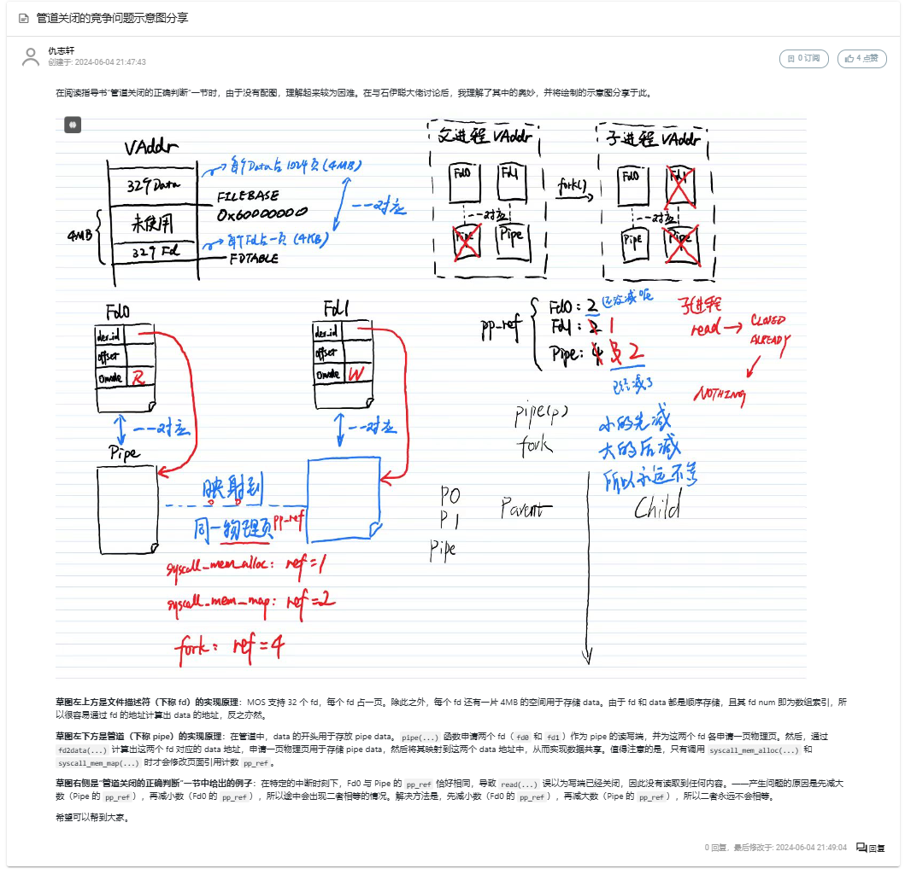

# lab6

## 思考题

### Thinking 6.1

> 示例代码中，父进程操作管道的写端，子进程操作管道的读端。如果现在想 让父进程作为“读者”，代码应当如何修改？

```c
// 互换源代码中父子进程部分
int main() {
    //...
    switch (fork()) {
        case -1 : 
            break;
        case 0 :	// 子进程
            close(fildes[0]); 
            write(fildes[1], "Hello world\n", 12); /* Write data on pipe */
            close(fildes[1]); 
            exit(EXIT_SUCCESS);
        default :	// 父进程
            close(fildes[1]); 
            read(fildes[0], buf, 100); /* Get data from pipe */
            printf("child-process read:%s",buf); /* Print the data */
            close(fildes[0]); 
            exit(EXIT_SUCCESS);
    }
}
```

### Thinking 6.2 

> 上面这种不同步修改 pp_ref 而导致的进程竞争问题在 user/lib/fd.c 中 的dup 函数中也存在。请结合代码模仿上述情景，分析一下我们的dup函数中为什么会出现预想之外的情况？

`dup`函数将`oldfdnum`所代表的文件描述符指向的数据复制给`newfdnum`文件描述符，包括

1. 将`newfd`所在的虚拟页映射到`oldfd`所在的物理页

2. 将`newfd`的数据所在的虚拟页映射到`oldfd`的数据所在的物理页

如果先映射fd0，再映射pipe：在pipe没有映射完毕时进程被中断(fd0已经+1，但pipe还没有来得及+1)，可能会导致另一进程调用`pipe_is_closed`，发现`pageref(fd[0]) = pageref(pipe)`，误以为读/写端已经关闭。

### Thinking 6.3

> 阅读上述材料并思考：为什么系统调用一定是原子操作呢？如果你觉得不是所有的系统调用都是原子操作，请给出反例。希望能结合相关代码进行分析说明。

进程切换是通过定时器产生时钟中断，触发时钟中断切换进程。但是syscall跳转到内核态后，关闭了时钟中断。

```c
exc_gen_entry:
	SAVE_ALL
	/*
	* Note: When EXL is set or UM is unset, the processor is in kernel mode.
	* When EXL is set, the value of EPC is not updated when a new exception occurs.
	* To keep the processor in kernel mode and enable exception reentrancy,
	* we unset UM and EXL, and unset IE to globally disable interrupts.
	*/
	mfc0    t0, CP0_STATUS
	and     t0, t0, ~(STATUS_UM | STATUS_EXL | STATUS_IE)
	mtc0    t0, CP0_STATUS
/* Exercise 3.9: Your code here. */
	mfc0	t0, CP0_CAUSE
	andi	t0, 0x7c
	lw		t0, exception_handlers(t0)
	jr		t0
```

### Thinking 6.4

> 按照上述说法控制 pipe_close中 fd和 pipe unmap的顺序，是否可以解决上述场景的进程竞争问题？给出你的分析过程。

可以。ref(p[0]) < ref(pipe)， 如果先解除p[0]的映射，只会让小的更小，从而避免出现相等的情况。


> 我们只分析了 close时的情形，在 fd.c中有一个 dup函数，用于复制文件描述符。 试想，如果要复制的文件描述符指向一个管道，那么是否会出现与 close类似的问 题？请模仿上述材料写写你的理解。

`dup`函数也会出现与`close`类似的问题。pipe的引用次数总比fd要高。当管道的`dup`进行到一半时， 如果先映射fd，再映射 pipe，就会使fd的引用次数的+1先于pipe(即Thinking 6.2 中的情况)，导致在两个`map`的间隙，可能出现`pageref(pipe) == pageref(fd)`。

这个问题也可以通过调换两个map的顺序来解决。

### Thinking 6.5 

>  思考以下三个问题。 
>
> + 认真回看Lab5文件系统相关代码，弄清打开文件的过程。 
>
> + 回顾Lab1与Lab3，思考如何读取并加载ELF文件。
>
> + 在Lab1 中我们介绍了 data text bss 段及它们的含义，data 段存放初始化过的全局变量，bss段存放未初始化的全局变量。关于memsize和filesize，我们在Note 1.3.4中也解释了它们的含义与特点。关于Note1.3.4，注意其中关于“bss段并不在文件中占数据”表述的含义。回顾Lab3并思考：elf_load_seg()和load_icode_mapper() 函数是如何确保加载ELF文件时，bss段数据被正确加载进虚拟内存空间。bss段在ELF中并不占空间，但ELF加载进内存后，bss段的数据占据了空间，并且初始值都是0。请回顾elf_load_seg() 和 load_icode_mapper() 的实现，思考这一点是如何实现的？ 
>

> 下面给出一些对于上述问题的提示，以便大家更好地把握加载内核进程和加载用户进程的区别与联系，类比完成 spawn函数。

关于第一个问题，在Lab3中我们创建进程，并且通过 ENV_CREATE(...) 在内核态加载了初始进程，而我们的 spawn函数则是通过和文件系统交互，取得文件描述块，进而找到ELF 在“硬盘”中的位置，进而读取。 

关于第二个问题，各位已经在Lab3中填写了load_icode 函数，实现了ELF 可执行文件中读取数据并加载到内存空间，其中通过调用elf_load_seg 函数来加载各个程序段。 在Lab3 中我们要填写 load_icode_mapper 回调函数，在内核态下加载 ELF 数据到内存空间；相应地，在Lab6中spawn函数也需要在用户态下使用系统调用为ELF数据分配空间。

当加载到`bin_size~sgsize`之间的数据时，就知道新入了`bss`端，使用`bzero`函数赋值为0，不需要再读取ELF的数据。

### Thinking 6.6

>  通过阅读代码空白段的注释我们知道，将标准输入或输出定向到文件，需要我们将其dup到0或1号文件描述符（fd）。那么问题来了：在哪步，0和1被“安排”为标准输入和标准输出？请分析代码执行流程，给出答案。

```c
// user\init.c
	// stdin should be 0, because no file descriptors are open yet
	if ((r = opencons()) != 0) {
		user_panic("opencons: %d", r);
	}
	// stdout
	if ((r = dup(0, 1)) < 0) {
		user_panic("dup: %d", r);
	} 
```

### Thinking 6.7

>  在 shell 中执行的命令分为内置命令和外部命令。在执行内置命令时shell不需要fork 一个子 shell，如 Linux 系统中的 cd 命令。在执行外部命令时 shell 需要 fork 一个子shell，然后子 shell 去执行这条命令。 
>
>  据此判断，在MOS 中我们用到的 shell 命令是内置命令还是外部命令？请思考为什么 Linux 的 cd 命令是内部命令而不是外部命令？



shell命令是外部命令，因为在执行shell命令时，当前进程通过`fork`产生一个子进程，也就是子shell，然后这个子shell来运行该命令所对应的可执行文件。

- linux中的内部命令实际上是shell程序的一部分，其中包含的是一些比较简单的linux系统命令，这些命令由shell程序识别并在shell程序内部完成运行，通常在linux系统加载运行时shell就被加载并驻留在系统内存中。因为`cd`指令非常简单，将其作为内部命令写在bashy源码里面的，可以避免每次执行都需要fork并加载程序，提高执行效率。

### Thinking 6.8

>  在你的 shell 中输入命令 ls.b | cat.b > motd。 
>
>  请问你可以在你的shell 中观察到几次spawn？分别对应哪个进程？

有两次spawn，分别打开了ls.b，cat.b进程

>  请问你可以在你的shell 中观察到几次进程销毁？分别对应哪个进程？

有四个进程的销毁，分别是左指令的执行进程，右指令的执行进程，spawn打开的两个执行进程。



## 难点分析

#### 管道竞争问题

感谢同学在讨论区分享！



#### spawn函数流程

1. 使用文件系统提供的 open函数打开即将装载的 ELF文件 prog。
2. 使用系统调用 syscall_exofork 函数为子进程申请一个进程控制块。 
3. 使用 init_stack 函数为子进程初始化栈空间，将需要传递的参数 argv传入子进程。 
4. 使用 elf_load_seg 将 ELF 文件的各个段加载进子进程。 
5. 设置子进程的运行现场寄存器，将 tf->cp0_epc设置为程序入口点，tf->regs[29]设置 为装载参数后的栈顶指针，从而在子进程被唤醒时以正确的状态开始运行。 
6. 将父进程的共享页面映射给子进程，与 fork不同的是，这里只映射共享页面。 7. 使用系统调用 syscall_set_env_status 唤醒子进程。

## 实验体会

在此个lab中，学习了解了管道的原理与底层的一些细节，实现了基本shell。可能是课程马上要结束，从lab5开始就慢慢有一种力不从心的感觉，看很久很久才能参悟到一点点（好吧面对庞大精细的操作系统我应该还有很多很多远远不知道的内容）。不管怎样，去慢慢地尝试一点点丰富构造MOS确实是一个很酷的过程。
